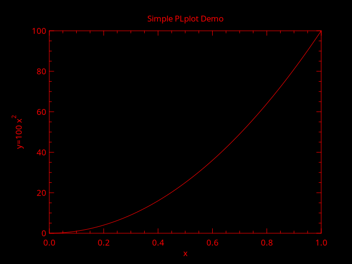

# Overview

`janet-plplot` is a wrapper library for the [PLplot](https://plplot.sourceforge.net/) plotting library for the [Janet](https://janet-lang.org/) programming language.

# Installation

Using the [`jpm`](https://github.com/janet-lang/jpm) package management tool
```
jpm install https://github.com/chamaeleon/janet-plplot.git
```

The PLplot library requires installation as well along with drivers for GUI display of graphs, separately from installing this wrapper library. On Ubuntu 24.04, for example, `libplplot17`, plus probably one or more of `plplot-driver-cairo`, `plplot-driver-qt`, `plplot-driver-wxwidgets`, and `plplot-driver-xwin` is recommended.

# Example usage

Given the following code in a Janet source file results in the image below (it was generated using the `xcairo` driver)

```lisp
(import plplot/plplot :as pl)

(def N 100)
(def xs @[])
(def ys @[])

(each i (range (inc N))
  (let [x (/ i N)
        y (* N x x)]
    (array/push xs x)
    (array/push ys y)))

(pl/plparseopts (dyn *args*))
# Specify a device here, or use the -dev command line option
# (pl/plsdev "xcairo")
(pl/plinit)
(pl/plenv 0 1 0 N 0 0)
(pl/pllab "x" (string/format "y=%d x#u2#d" N) "Simple PLplot Demo")
(pl/plline xs ys)
(pl/plend)
```
